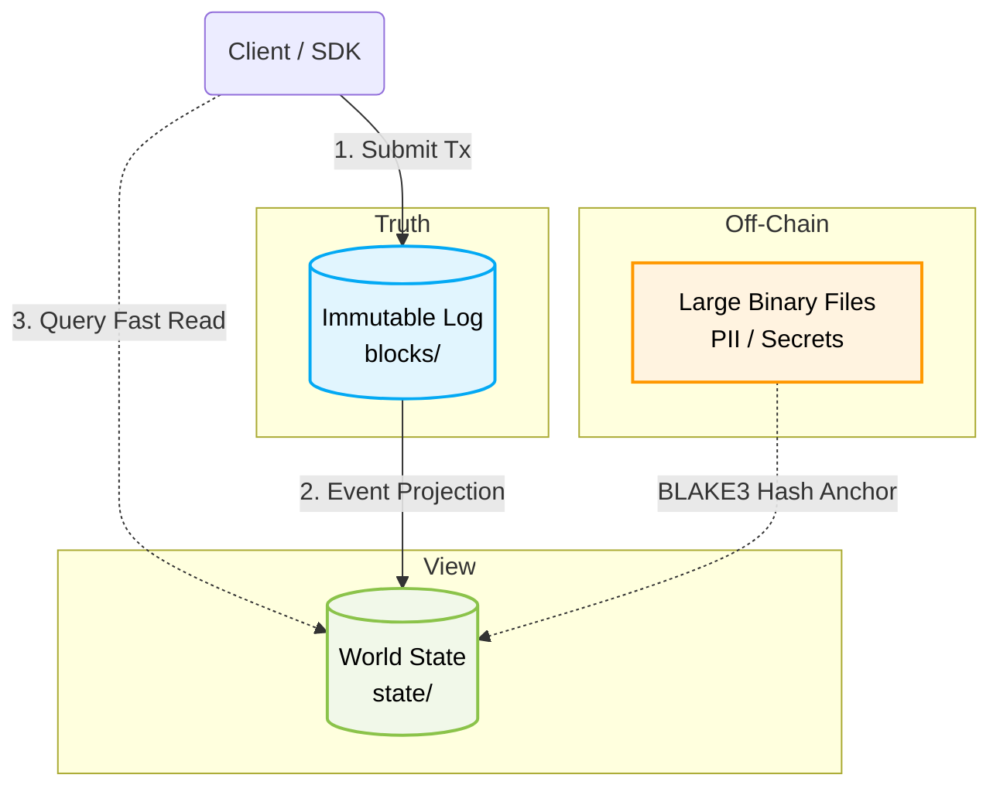
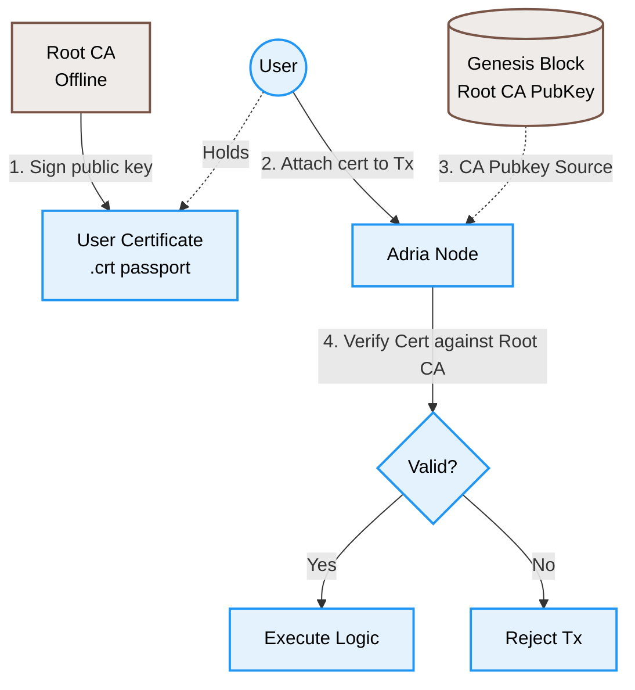
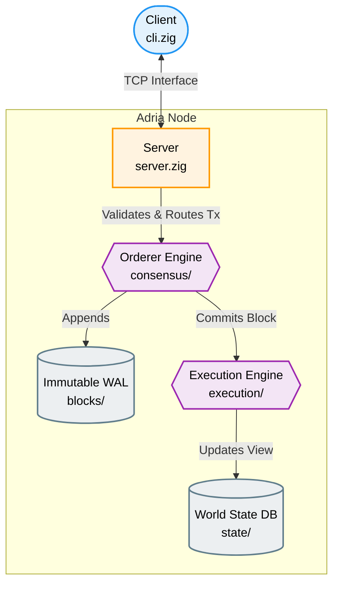
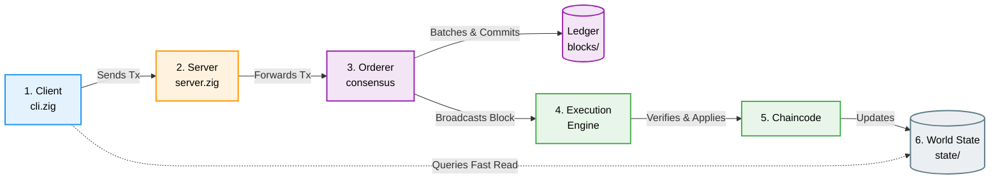
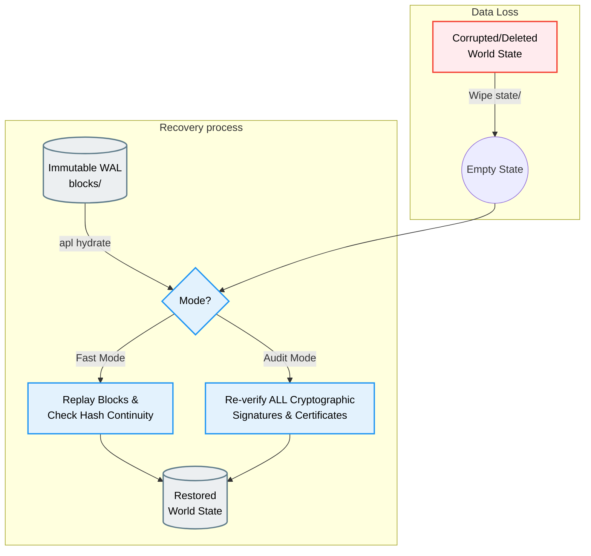

# Adria Permissioned Ledger (APL)

> A lightweight, high-performance blockchain framework designed for enterprise use cases, featuring identity management, pluggable consensus, and a generic key-value world state.

---

## Overview

The **Adria Permissioned Ledger (APL)** is a modular blockchain framework built in **Zig**. Unlike permissionless blockchains that rely on energy-intensive Proof-of-Work and native currencies, APL is designed for known, trusted participants in a private network.

It provides a robust foundation for building decentralized applications that require:
*   **Identity & Permissioning**: Built-in Membership Service Provider (MSP) and Role-Based Access Control (RBAC).
*   **High Throughput**: Decoupled "Orderer" service for efficient block production.
*   **Deterministic Finality**: Transactions are irreversibly committed the moment a block is sealed.
*   **Immutable Audit Trail**: Every event is permanently recorded in a cryptographically-linked Write-Ahead Log.

## Key Features

*   **Lightweight Core**: Written in Zig for ease of deployment, low memory footprint, and high performance.
*   **Permissioned / MSP**: No anonymous keys. All participants are rigorously authenticated via Ed25519 cryptographic certificates signed by an on-chain Root Certificate Authority (CA).
*   **Modular Architecture**:
    *   **Consensus**: Pluggable interface supporting "Solo" (avail) and "Raft" (planned).
    *   **State**: Generic Key-Value store (World State) abstracted from the ledger logic.
    *   **Logic**: System Chaincodes for generic ledger recording, asset management, **document storage**, and **dataset management**.
*   **Schema-Agnostic**: Support for rich 64KB JSON payloads via `DocumentStore`, and massive JSON arrays via the `DatasetStore` using client-side materialization to enforce pure Event Sourcing.
*   **Fee-less**: No gas fees or native cryptocurrency. Spam is prevented via identity and rate limiting.
*   **Cryptography**: High-performance primitives (Ed25519 for signatures, BLAKE3 for content hashing) with **Parallel Verification**.
*   **Event Sourcing**: The Blockchain is the immutable Write-Ahead Log (WAL). The State (SQL/KV) is a disposable View that can be fully reconstructed from the chain.
*   **Version Control**: Strict decoupling of Implementation Engine version from Protocol Rules ensuring deterministic replay independent of binary upgrades.

## Architecture

Adria implementation follows a strict **Event Sourcing** pattern, separating the **Immutable Log** (Truth) from the **Mutable State** (View).

### Why Adria?
Unlike standard databases where deleting a file destroys history, Adria provides **Reconstructible State**:
1.  **Truth (The Chain)**: Every transaction is cryptographically signed and appended to the immutable log (`blocks/`). This is the single source of truth.
2.  **View (The State)**: The "World State" (`state/`) is merely a cached projection of the chain.
    - **Performance**: You query the State for millisecond-latency reads.
    - **Safety**: If the State is corrupted or deleted, Adria can **Rehydrate** it by replaying the Chain from Block 0.
    - **Reconstructability**: You can rebuild the state on a fresh machine to cryptographically verify the entire history.

### Data Design: The Event Sourcing Model



Because Adria is an Event Sourcing engine, "On-Chain Storage" is split into two distinct concepts: the **Immutable Log** and the **World State**.

1.  **The Immutable Log (The Blockchain / WAL)**:
    *   **All Payloads**: Every executed transaction, including its full payload, is stored here forever.
    *   **Massive Datasets**: Multi-megabyte JSON arrays are chunked and appended to the WAL via `DatasetStore`. The engine never loads these into the World State, instead acting purely as an immutable Hash Authority. The `apl` CLI queries the WAL to reconstruct and diff the arrays in memory.
    *   *Why?* **100% Reconstructible**. If you lose your database, `apl hydrate` will replay the log to restore it completely.

2.  **The World State (The View)**:
    *   **Business Logic State**: Status codes (`APPROVED`, `PENDING`), account nonces, and ownership records.
    *   **Metadata & Hashes**: Cryptographic anchors linking to off-chain data or massive on-chain datasets.
    *   **Small Documents**: JSON configuration objects and lightweight structured data (up to 64KB) are optionally materialized here for rapid O(1) reads.
    *   *Why?* **Performance**. The State is a cached projection of the log, optimized for millisecond-latency reads without parsing historical blocks.

3.  **Off-Chain (Private)**:
    *   **Large Binary Files**: PDF Invoices, High-Res Photos.
    *   **Sensitive Data**: PII (Names, Addresses), Trade Secrets.
    *   *How?* Store the file locally, calculate its **BLAKE3 hash**, and store *only the hash* in the World State.
    *   *Warning*: **Not Reconstructible**. The chain only holds the fingerprint. You are responsible for backing up the actual files.

4.  **Identity (The Certificate Authority)**:



    *   *How it works*: Adria uses a hybrid approach for identities to keep the ledger lightweight.
    *   **On-Chain Root CA**: The identity of the Root Certificate Authority is baked into the immutable blockchain (Block 0 / Genesis Block) via the `seed_root_ca` configuration. This acts as the ultimate source of truth for who is trusted to authorize users.
    *   **Off-Chain CertificateV2**: When a user registers, the Root CA issues them a **CertificateV2** (`apl cert issue`). This certificate embeds the user's public key, a unique serial number, and an expiry timestamp. It is stored as an off-chain `.crt` file (a "digital passport"). There is *no on-chain transaction* created for issuance, preventing chain bloat.
    *   **Transaction Validation**: When a user submits a business transaction, they attach their CertificateV2 fields. Nodes verify: (1) the Root CA signature, (2) the certificate has not expired, and (3) the certificate serial is not on the on-chain Certificate Revocation List (CRL).

### Modular Components



| Component | Responsibility |
| :--- | :--- |
| **Client** (`cli.zig`) | Signs transactions, queries state, manages keys. |
| **Server** (`server.zig`) | Handles networking, RPCs, and the "Adria Protocol". |
| **Orderer** (`consensus/`) | Batches transactions into blocks (The WAL). |
| **Peer** (`execution/`) | Validates blocks and updates the World State (The View). |

### Data Flow (Lifecycle of an Event)



1.  **Client (`cli.zig`)** creates a payload, signs it with a `wallet`, and sends a `Transaction` to the **Server**.
2.  **Server (`server.zig`)** validates the protocol header and forwards the Tx to the **Consensus Engine (`main.zig`)**.
3.  **Orderer** batches the Tx into a **Block**, timestamps it, and appends it to the immutable ledger (`blocks/`).
4.  **Orderer** broadcasts the committed Block to the **Execution Engine**.
5.  **Execution Engine** verifies the Block signature and sequentially applies transactions to the **Chaincode (`chaincode.zig`)**.
6.  **Chaincode** updates the **World State (`db.zig`)**, which the Client can then query instantly.

### State Reconstruction



Adria includes a tool, `apl hydrate`, to rebuild the state from scratch.

*   **Fast Mode (Default)**: Replays blocks to rebuild state, checking hash continuity chains (Trust-On-First-Use). Fast state recovery.
*   **Audit Mode (`--verify-all`)**: Re-verifies **every cryptographic signature** and certificate on every transaction in history. This provides a mathematical guarantee that the current state is the result of valid, authorized transactions.

#### Dataset Differential Calculation
When dealing with massive structured datasets (`DatasetStore`), the engine behaves exclusively as an immutable hash validator rather than a traditional state machine:
*   **Engine-Side**: The Chaincode parses the JSON chunk, validates its structure, and generates a canonical hash. It then *completely drops* the payload from the World State to maintain high throughput and low memory overhead. The raw data only persists in the Write-Ahead Log.
*   **Client-Side Diffing**: Differential calculation (`apl dataset diff`) is performed entirely client-side. The CLI queries the native WAL (blocks) to reconstruct the full JSON arrays in-memory, computing the structural diff directly on the client machine. This offloads heavy computation from the consensus engine, enabling massive scalability.

### 1. Entry Points
*   **`main.zig`**: The heart of the blockchain logic.
    *   **Orchestration**: Initializes the `Adria` struct, loads the database, and connects networking.
    *   **Consensus Engine**: Hosts the pluggable orderer (`Solo` or `Raft`).
    *   **Execution Sync Loop**: Background thread that polls for committed blocks and updates the state.
*   **`cli.zig`**: The Command Line Interface (`apl`).
    *   **User Interaction**: Handles commands like `wallet create`, `status`, `ledger record`.
    *   **Client Logic**: Connects to the server to submit transactions or query state.
*   **`server.zig`**: The Network Server (`adria_server`).
    *   **Listener**: Binds to TCP port (default 10802).
    *   **Protocol**: Handles the "Adria Protocol" (handshakes, transaction submission, block broadcasting).
    *   **RPC Handler**: Routes Raft RPCs (`RAFT_VOTE`, `RAFT_APPEND`) to the Consensus Engine.

### 2. Execution Module (`core-sdk/execution/`)
*   **`db.zig`**: The Persistence Layer.
    *   **World State**: Manages the `state/` directory using a custom **Bitcask** engine (Append-Only Log).
    *   **Storage Abstraction**: Provides O(1) `put(key, val)` and `get(key)` via in-memory indexing.
*   **`chaincode.zig`**: The Smart Contract Layer.
    *   **Interfaces**: Defines `Chaincode` and `Stub` traits for building contracts.
    *   **System Contracts**: Implements built-in logic like `GeneralLedger` (KV Store) and `AssetLedger` (Mint/Transfer).
*   **`acl.zig`**: Access Control Lists.
    *   **Permissions**: Defines `Role` enums (Admin, Writer, Reader).
    *   **Enforcement**: Checking if a specific wallet address has the right to execute a function.

### 3. Consensus Module (`core-sdk/consensus/`)
*   **`mod.zig`**: The Interface.
    *   Defines `Consenter` struct with VTable (Start, Stop, RecvTransaction).
    *   Allows `main.zig` to be agnostic of the ordering mechanism.
*   **`solo.zig`**: Single Node Orderer.
    *   Simple batching logic (size/time triggers).
*   **`raft.zig`**: Distributed Consensus (Planned).

## Directory Structure

*   `core-sdk/` - The main Zig implementation.
    *   `execution/` - State machine, DB, Chaincode, and ACL.
    *   `consensus/` - Ordering interfaces and implementations (Solo).
    *   `network/` - P2P networking and protocol handlers.
    *   `crypto/` - Cryptographic primitives (Ed25519, BLAKE3, Certificates).
    *   `ingestion/` - Transaction pool and parallel verification workers.
*   `tests/` - Integration, functional, and security tests.

### Quick Start

#### 1. Prerequisites
*   **Zig**: Version **0.14.1**.
*   **Docker Desktop**: Required for multi-node simulation and containerized benchmarking.
*   **Python 3**: Required for the client demo scripts.

#### 2. Clone the Repository
```bash
git clone https://github.com/markoivan7/adria-ledger.git
cd adria-ledger
```

#### 3. Build the Project
Use the provided `Makefile` to build both the Server and CLI:
```bash
make build
```

Or manually:
```bash
cd core-sdk
zig build
```

#### 4. Run the Full Test Suite
Validate that all tests (Core, CLI, Document, Security) pass:
```bash
make test
```
#### 5. Configuration (`adria-config.json`)

**Key Settings:**
*   `network.bind_address`: Default is `127.0.0.1`.
*   `network.network_id`: Unique 64-bit identifier for the network instance. Generated randomly by default on first run to prevent cross-network replay attacks.
*   `consensus.role`: `orderer` (produces blocks) or `peer` (validates only).

**Example `adria-config.example.json`:**
```json
{
    "network": {
        "p2p_port": 10801,
        "api_port": 10802,
        "discovery": true,
        "bind_address": "127.0.0.1",
        "network_id": 1
    },
    "storage": {
        "data_dir": "apl_data",
        "log_level": "info"
    },
    "consensus": {
        "mode": "solo",
        "role": "peer"
    }
}
```

## Test Suite & Demos

Adria includes several pre-built scenarios to verify functionality.

### 1. General Ledger PoC (Functional Integrity)
**Goal:** Verify the integrity of the ledger and the storage model.
*   **What it does:** Simulates a client recording data, validates cryptographic anchors, and ensures the World State matches the blockchain history.
*   **Command:**
    ```bash
    make test-core
    ```

### 2. Asset Transfer Demo
**Goal:** Demonstrate the `AssetLedger` system chaincode.
*   **What it does:** Mints new assets to an admin wallet and performs transfers between users, verifying balances at each step.
*   **Command:**
    ```bash
    make test-asset
    ```

### 3. Reconstructability Test
**Goal:** Verify that the "World State" can be completely deleted and faithfully reconstructed from the blockchain history.
*   **What it does:** Generates transactions, deletes the state database, and runs `apl hydrate` to rebuild it, confirming bit-for-bit identity.
*   **Command:**
    ```bash
    make test-reconstruct
    ```

### 4. Document Store (Large Payload)
**Goal**: Verify storage and retrieval of large documents (up to 60KB).
*   **What it does**: Stores a 50KB+ file on-chain and verifies state persistence.
*   **Command**:
    ```bash
    make test-document
    ```

### 5. Dataset Query Interface
**Goal**: Verify the generic dataset abstraction layer and its hashing.
*   **What it does**: Exercises payload chunking, structural engine-side hashing, chronological snapshotting, and the O(1) diffing interface.
*   **Command**:
    ```bash
    make test-dataset
    ```

### 6. Large Dataset Ingestion & Diff
**Goal**: Verify that the node can ingest, process, and perform structural diffs on massive JSON arrays (e.g. 100,000+ rows).
*   **What it does**: Dynamically generates two 30MB+ JSON payloads, uploads the chunks to the server, commits the snapshots, computes the $O(1)$ diff, and formats the output into `diff_large.json`. Validates that dynamic memory buffers scale correctly without dropping connections.
*   **Command**:
    ```bash
    make test-large-dataset
    ```

### 7. CLI Verification Suite
**Goal:** Verify all Command-Line Interface operations.
*   **What it does:** Tests wallet creation, certificate issuance, offline signing, broadcasting, and ledger queries via the `apl` CLI.
*   **Command:**
    ```bash
    make test-cli
    ```

### 8. Offline Signing Verification
**Goal:** Verify that transactions can be signed securely without network access.
*   **What it does:** Creates an offline tester identity, retrieves network ID and nonce, generates a raw offline signature, and broadcasts it for successful inclusion.
*   **Command:**
    ```bash
    make test-offline
    ```

### 9. Governance Unit Tests
**Goal:** Verify protocol governance and access control logic.
*   **What it does:** Runs native Zig unit tests to validate role-based access control, validator signatures, and genesis block configuration.
*   **Command:**
    ```bash
    make test-governance
    ```

### 10. Security Testing (DoS Protection)
**Goal**: Verify the node's resilience against common network attacks.
*   **What it does**: Floods the node with malformed packets, invalid protocol messages, and rapid connection attempts.
*   **Command**:
    ```bash
    make test-security
    ```

### 11. Certificate Lifecycle Test
**Goal**: Verify the full end-to-end certificate lifecycle against a live node.
*   **What it does**: Issues a `CertificateV2` to a user, confirms the user can transact, revokes the certificate via the on-chain CRL, confirms the next transaction is rejected, re-issues a fresh certificate (new serial), and confirms the user can transact again. Also exercises `cert inspect` and `cert audit`.
*   **Command**:
    ```bash
    make test-cert-lifecycle
    ```

### 12. Certificate Security Regression Tests
**Goal**: Verify that adversarial certificate scenarios are correctly rejected by the node.
*   **What it does**: Tests three live rejection scenarios — (1) an uncertified wallet with no `.crt` file, (2) a transaction signed with the wrong `network_id`, and (3) a transaction from a wallet whose certificate serial has been added to the on-chain CRL. Expired certificate and timestamp boundary enforcement are confirmed via Zig unit tests (`key.zig`, `types.zig`).
*   **Command**:
    ```bash
    make test-cert-security
    ```

### 13. Full Integrated Test Suite
**Goal**: Run all end-to-end regression tests to ensure total system integrity.
*   **What it does**: Automatically executes all the above functional suites.
*   **Command**:
    ```bash
    make test
    ```

## Performance Benchmarking

Measure throughput and latency under high load.

### 1. Local Benchmark (Single Node)
**Goal:** Test raw ingestion speed and execution efficiency (Leader Mode).
*   **Environment:** Single local process (Release Mode) on Apple Silicon.
*   **Configuration:** 2000 Tx Batch.
*   **Command:**
    ```bash
    make bench
    ```

### 2. Docker Cluster Benchmark (Multi-Node)
**Goal:** Simulate a realistic production network with 3 nodes (Orderer + 2 Peers).
*   **Environment:** Docker Containers (Alpine Linux).
*   **Validation:** Verifies propagation, consensus, parallel verification, and end-to-end finality.
*   **Command:**
    ```bash
    make bench-docker
    ```

## Manual Development Mode

For interactive testing, you can run the server and CLI manually. However, because Adria is a permissioned ledger, you must configure a Root CA first.

**1. Create the Root CA Identity**
```bash
./core-sdk/zig-out/bin/apl wallet create my_root_ca
./core-sdk/zig-out/bin/apl pubkey my_root_ca --raw
```
*Copy the resulting public key hex string and add it to `adria-config.json` under `consensus.seed_root_ca`.*

**2. Start the Server**
```bash
ADRIA_WALLET_PASSWORD=<your_orderer_wallet_password> make run
```
*Starts Orderer on localhost (P2P: 10801, API: 10802). The server reads the orderer wallet password from `ADRIA_WALLET_PASSWORD` — it cannot prompt interactively as a daemon.*

**3. Run CLI Commands**
Open a new terminal to create your execution wallet and issue it a certificate:
```bash
# Create wallet
./core-sdk/zig-out/bin/apl wallet create mywallet

# Issue a CertificateV2 to 'mywallet' signed by the Root CA (default: 365-day validity)
./core-sdk/zig-out/bin/apl cert issue my_root_ca mywallet

# Issue with a custom validity period
./core-sdk/zig-out/bin/apl cert issue my_root_ca mywallet --validity-days 90

# Revoke a certificate (submits serial to the on-chain CRL)
./core-sdk/zig-out/bin/apl cert revoke my_root_ca mywallet

# Audit certificate usage history for an address (scans local WAL)
./core-sdk/zig-out/bin/apl cert audit <address_hex>

# Record data to the ledger
./core-sdk/zig-out/bin/apl ledger record invoice:001 "{\"amt\": 500}" mywallet
```

### CLI Command Reference

The `apl` binary (`./core-sdk/zig-out/bin/apl`) supports the following commands:

| Domain | Command | Description |
| :--- | :--- | :--- |
| **Wallet** | `wallet create [name]` | Generating a new Ed25519 keypair and saving it to `apl_data/wallets`. |
| | `wallet load [name]` | Verifying that an existing wallet can be loaded. |
| | `wallet list` | Listing all available local wallets. |
| **Network** | `status` | Querying the server for current block height and sync status. |
| | `address [wallet] [--raw]` | Displaying the address (hex) of a specific wallet. |
| **Identity** | `pubkey [wallet] [--raw]` | Displaying the public key (hex) of a specific wallet. |
| | `cert issue <signer_wallet> <target_wallet> [--validity-days N]` | Issue a CertificateV2 for `target_wallet`, signed by the Root CA. Default validity is 365 days. |
| | `cert revoke <signer_wallet> <target_wallet>` | Revoke `target_wallet`'s certificate by submitting its serial number to the on-chain CRL via a governance transaction. |
| | `cert audit <address_hex> [data_dir]` | Scan the local WAL for all transactions from an address and print a certificate usage report (total tx, first/last seen, serials used, peak hour). |
| | `nonce <address>` | Querying the current nonce for an address. |
| **Transaction** | `tx sign <payload> <nonce> <net_id> [wallet]` | Generating a raw offline signature without connecting to a node. |
| | `tx broadcast <raw_tx>` | Broadcasting a pre-signed transaction payload to the network. |
| **Ledger** | `ledger record <key> <val> [wallet]` | Submitting a generic data entry to the blockchain. |
| | `ledger query <key> [data_dir]` | Querying the state for a specific key (Proof of Existence). |
| **Documents** | `document store <collection> <id> <file> [wallet]` | Storing a large document (up to 60KB) on-chain. |
| | `document retrieve <collection> <id> [data_dir]` | Retrieving a stored document from the local state. |
| **Datasets** | `dataset append <dataset> <snap_id> <json_file> [wallet]` | Appending a chunk of array records to a temporary snapshot payload. |
| | `dataset commit <dataset> <snap_id> [wallet]` | Committing the fully uploaded snapshot array over the 64KB transaction limit into the dataset. |
| | `dataset current <dataset> [data_dir]` | Querying the current finalized state of a dataset. |
| | `dataset history <dataset> [data_dir]` | Querying the snapshot history of a dataset. |
| | `dataset diff <snap_a> <snap_b> [data_dir]` | Generating a structural diff (added, removed, modified) based on engine hashes. |
| **Invocation** | `invoke <payload> [wallet]` | Invoking a raw chaincode payload string directly. |
| **Governance**| `governance update <policy.json> [wallet]` | Submitting a governance policy update to the network. |
| | `governance get [data_dir]` | Querying the local state for the active governance policy (sys_config). |
| **Reconstruction**| `hydrate [--verify-all]` | Reconstructs the World State from the Block history. |
| **Engine** | `engine backup [dest]` | Snapshot `blocks/`, `state/`, `wallets/`, and config before a same-protocol binary swap. Writes `backup_manifest.json`. |
| | `engine checkpoint [dest]` | Full migration tool for a protocol version bump. Automatically takes a safety backup, transfers state, and writes a new genesis block at the new protocol version. Writes `checkpoint_manifest.json`. |

> **Note**: Set the `ADRIA_SERVER` environment variable to target a specific IP (default `127.0.0.1`).
> Run `apl engine` (no subcommand) for workflow details and examples.

## Managing the Environment

### Stopping & Resetting
To stop all running nodes and clean up data:

**1. Docker Cluster:**
```bash
# Stop containers and remove data volumes
make clean-docker
# Or manually: docker-compose down -v
```

**2. Local Processes:**
```bash
# Kill running adria_server processes
make kill
```

**3. Full Reset (Nuclear Option):**
```bash
# Kills local processes, removes local data, and nukes Docker cluster
make reset-all
```

## Engine Upgrade Guide

APL separates the **engine version** (the binary) from the **protocol version** (the consensus and state-transition rules embedded in every block). Understanding which scenario applies determines whether a simple backup or a full migration checkpoint is needed.

### Version System

| Term | Where defined | Meaning |
| :--- | :--- | :--- |
| `ENGINE_VERSION` | `common/types.zig` | Semver of the binary implementation (e.g. `0.1.0`). |
| `SUPPORTED_PROTOCOL_VERSION` | `common/types.zig` | Integer version of the consensus and execution rules (e.g. `2`). Every block header carries this value, and the node refuses to start if the genesis block's version does not match. |

Check the running values at any time:
```bash
apl version
```

---

### Scenario A — Same-Protocol Engine Upgrade

**When to use:** The new binary keeps the same `SUPPORTED_PROTOCOL_VERSION`.
**Example:** Engine `0.1.0` → `0.2.0`, protocol stays at `v2`.

The block files, state database, and wallets are fully compatible. Only the binary changes.

```
┌─────────────────────────────────────────────────────────────────────┐
│ Upgrade workflow                                                     │
│                                                                      │
│  1. Stop the server                                                  │
│  2. apl engine backup [dest]  ← creates a snapshot before swapping  │
│  3. Replace the binaries (adria_server and apl)                      │
│  4. Restart the server — data is unchanged, startup check passes     │
│                                                                      │
│  If anything goes wrong: restore data dir from the backup and        │
│  revert to the old binary.                                           │
└─────────────────────────────────────────────────────────────────────┘
```

**What `apl engine backup` copies:**

| Path | Purpose |
| :--- | :--- |
| `<data_dir>/blocks/` | Immutable ledger (the WAL). Every `.block` file. |
| `<data_dir>/state/state.data` | Bitcask state snapshot. Avoids a full `hydrate` replay on restore. |
| `<data_dir>/wallets/` | Node key material (orderer wallet, etc.). |
| `adria-config.json` | Node configuration. |
| `backup_manifest.json` | Metadata: engine version, protocol version, block height, timestamp. |

**To restore from a backup:**
```bash
# 1. Stop the server
# 2. Replace the active data directory with the backup
mv apl_data apl_data_old
cp -r <backup_dir> apl_data
# 3. Restart
```

---

### Scenario B — Protocol Version Bump

**When to use:** `SUPPORTED_PROTOCOL_VERSION` changes between the old and new binary.
**Example:** Protocol `v2` → `v3`.

The live node performs a **strict equality check** against the genesis block's protocol version on every startup. A new binary that bumps the protocol constant will refuse to start against an existing `v2` chain — by design, to prevent silent state divergence from applying `v3` execution rules to `v2` blocks.

The block files themselves are **never unreadable** — each block header carries its own `protocol_version` and the `hydrate` tool handles all historical versions via a versioned switch. What changes is the chain's *governance contract*, not the bytes on disk.

`apl engine checkpoint` automates the full migration in one command.

```
┌─────────────────────────────────────────────────────────────────────┐
│ Checkpoint migration workflow                                        │
│                                                                      │
│  1. Stop the server (required — no live writes during migration)     │
│  2. Build / obtain the new engine binary                             │
│  3. Run the OLD binary to create the checkpoint:                     │
│       apl engine checkpoint [dest_dir]                               │
│     This performs four steps automatically:                          │
│       [1/4] Safety backup → apl_pre_checkpoint_backup_<ts>/         │
│       [2/4] Read chain height + hash of the last block (seal)        │
│       [3/4] Copy state/ and wallets/ to the checkpoint directory     │
│       [4/4] Write block 0 (new genesis) stamped with the new         │
│             protocol version from the binary being run               │
│  4. Point adria-config.json storage.data_dir at the checkpoint dir  │
│  5. Start the new engine binary — genesis check passes               │
└─────────────────────────────────────────────────────────────────────┘
```

**What `apl engine checkpoint` produces:**

| Path | Content |
| :--- | :--- |
| `apl_pre_checkpoint_backup_<ts>/` | Full safety backup of the old chain. Never deleted. |
| `<checkpoint_dir>/blocks/000000.block` | New genesis block stamped with `SUPPORTED_PROTOCOL_VERSION`. |
| `<checkpoint_dir>/state/state.data` | State database copied directly — key-value pairs are protocol-agnostic. |
| `<checkpoint_dir>/wallets/` | Node wallets copied from the source chain. |
| `<checkpoint_dir>/adria-config.json` | Config copied from source. Update `storage.data_dir` before starting. |
| `<checkpoint_dir>/checkpoint_manifest.json` | Metadata: new protocol version, sealed height, seal hash (last block hash of the old chain), timestamp. |

**The seal hash** in `checkpoint_manifest.json` is the BLAKE3 hash of the last block in the old chain. It provides a cryptographic link proving which exact chain state was migrated, without embedding it in the new genesis block.

**After a successful checkpoint, update `adria-config.json`:**
```json
{
  "storage": {
    "data_dir": "<checkpoint_dir>"
  }
}
```

**To roll back after a checkpoint:**
```bash
# Point config back at the old data dir (or restore from the safety backup)
# Revert to the old binary and restart
```

**Auditing old history after a protocol bump:**
The old chain's block files are preserved in the safety backup. The old binary can still replay them in full:
```bash
ADRIA_DATA=apl_pre_checkpoint_backup_<ts> apl hydrate --verify-all
```

---

### Choosing the Right Command

| Situation | Command |
| :--- | :--- |
| Upgrading the binary, same protocol version | `apl engine backup` then replace binary |
| Protocol version bump in the new binary | `apl engine checkpoint` |
| State is corrupted but blocks are intact | `apl hydrate` (no backup needed) |
| Disaster recovery — restore from backup | Restore files, restart |

---

## Identity, Key Management & Security

Security is critical for a permissioned ledger. Adria provides tools to help you manage your keys and network identities safely.

### Security Architecture: Defense in Depth

Adria implements a **three-layer security model** for transaction validation:

**How it works:**
1. **Network ID (u64)**: Prevents cross-network replay attacks. Each network has a unique 64-bit identifier that's cryptographically bound to every transaction signature.
2. **Certificate Verification**: The core security boundary. Every transaction must include a certificate proving the sender's public key was signed by a trusted Root CA. This is verified before any other processing.
3. **Signature Verification**: Ensures the transaction was actually signed by the owner of the claimed public key and hasn't been tampered with.

### Identity & Certificates (MSP)
Unlike permissionless networks where anyone can submit transactions anonymously, Adria relies on a **Root Certificate Authority (CA)** to authorize participants.
*   **Root CA**: The network is initialized with one or more public keys of a Root CA (`consensus.seed_root_ca` in the config).
*   **CertificateV2**: Before a participant can interact with the network, the Root CA must issue them a **CertificateV2** via `apl cert issue`. This certificate embeds the participant's public key, a unique serial number, and an expiry timestamp. It is stored as an off-chain file at `apl_data/wallets/<name>.crt` (153 bytes). There is no on-chain transaction for issuance, preventing chain bloat.
*   **Expiry**: Certificates are time-bounded. A 1-year validity is the default (`--validity-days 365`). The node rejects any transaction whose certificate has expired at block-commit time.
*   **Revocation (CRL)**: A compromised certificate can be revoked before its expiry. `apl cert revoke` reads the certificate's serial number and submits a `sys_governance|revoke_certificate|<serial>` transaction to the network. The node maintains an in-memory Certificate Revocation List (CRL) from governance state and rejects all transactions from revoked serials.
*   **Usage Monitoring**: Every validated transaction emits a `[CERT_USAGE]` log line with the certificate serial, sender address prefix, and nonce. A sliding 60-second rate tracker triggers a `[CERT_ALERT]` if a single serial exceeds 100 transactions per minute, flagging potential key compromise or replay floods.
*   **Audit Command**: `apl cert audit <address_hex> [data_dir]` scans the local WAL and prints a per-address report: total transactions, first/last seen timestamps, certificate serials used, and the peak-activity hour. Runs fully offline against the local block store.
*   **Enforcement**: The Orderer and Validators verify the sender's certificate on every transaction: (1) signature validity against the Root CA, (2) time-bound expiry, (3) serial not present in the CRL. Any failure rejects the transaction immediately.

#### Modifying the Config for the CA:
1. Create the CA identity: `apl wallet create my_root_ca`
2. Extract the public key: `apl pubkey my_root_ca --raw`
3. Add this hex string to `adria-config.json` under `consensus.seed_root_ca`.
4. Issue operator certificates: `apl cert issue my_root_ca user_wallet`
5. (Optional) Revoke a compromised certificate: `apl cert revoke my_root_ca user_wallet`
6. (Optional) Audit certificate usage: `apl cert audit <address_hex>`

### Wallet Format (`.wallet`)
Wallets are 192-byte binary files storing your Ed25519 keypair. The private key is encrypted; the public key and derived address are stored in plaintext for fast address display without decryption.

| Field | Size | Description |
| :--- | :--- | :--- |
| Version | 4 B | Format version (`2`) |
| Salt | 32 B | Random Argon2id salt |
| Nonce | 12 B | ChaCha20-Poly1305 nonce |
| Encrypted private key | 80 B | 64 B ciphertext + 16 B Poly1305 tag |
| Public key | 32 B | Ed25519 public key (plaintext) |
| Address | 32 B | `BLAKE3(public_key)` — cached for display |

*   **KDF**: **Argon2id** (t=3, m=64 MB, p=1) — memory-hard key derivation. Each wallet unlock allocates ~64 MB of RAM for ~100–200 ms on modern hardware, making offline brute-force attacks extremely expensive.
*   **Cipher**: **ChaCha20-Poly1305** (AEAD) — the Poly1305 tag authenticates both the ciphertext and the public key field. Tampering with any byte of the wallet file is detected immediately on load.
*   **Password (CLI)**: Prompted interactively with echo disabled at wallet creation (requires confirmation) and at every load. No password is ever stored on disk.
*   **Password (Server)**: `adria_server` is a daemon and cannot prompt interactively. Supply the orderer wallet password via the `ADRIA_WALLET_PASSWORD` environment variable before starting: `ADRIA_WALLET_PASSWORD=<password> ./adria_server --orderer`.
*   **Non-interactive (CI/Scripts)**: Set `ADRIA_WALLET_PASSWORD` to bypass the interactive prompt. All bundled test scripts use this automatically.
*   **Location**: Default storage is `apl_data/wallets/`.

### Security Best Practices

For comprehensive security guidance, see **[Security Best Practices](docs/SECURITY_BEST_PRACTICES.md)**.

## License

Open Source.
